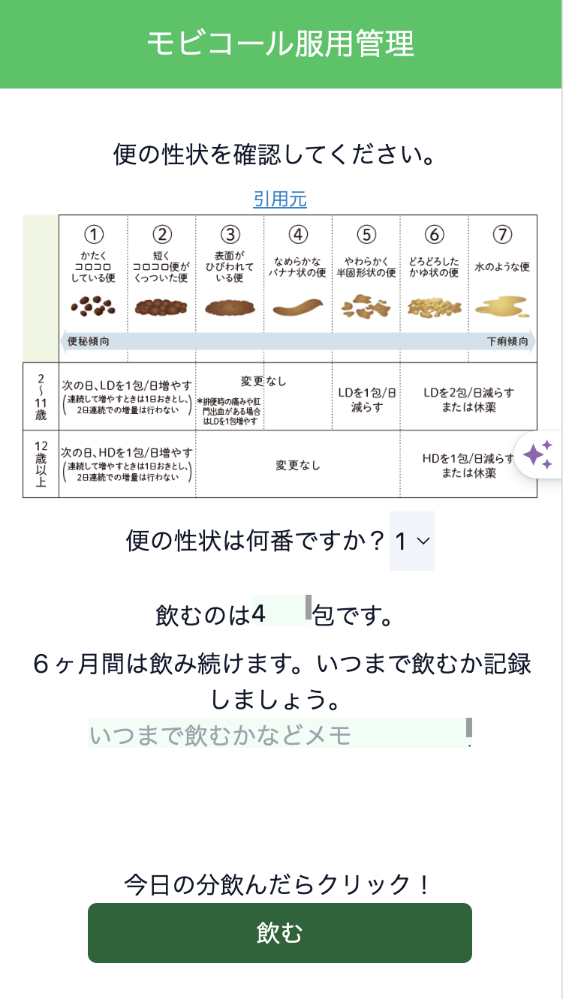

# kadai03-memo
JS3 - メモパッドアプリ

# ①課題番号-プロダクト名
モビコール®️服用管理アプリ

## ②課題内容（どんな作品か）
- 便秘薬のモビコールの飲み方が複雑だったので、その内容を確認しつつメモできるようなアプリを制作しました。

## ③DEMO

## ④工夫した点・こだわった点
- 自分自身が欲しい機能をつけました（便の性状チェック、包数記録、いつまで飲むか記録）
- tailwindでSP対応もしました
- 

## ④難しかった点・次回トライしたいこと(又は機能)
- JSONの理解が難しく、やっとできたという感じです
- 次はselectタグで選択した内容を取得して他の数字を動かす、ということをやりたいです（多分イベントリスナー）

## ⑤質問・疑問・感想、シェアしたいこと等なんでも
- [質問] selectタグで選んだ内容を取得、と調べるとイベントリスナーしか出てこず、理解が難しそうだったので見送ったのですが他の方法でできたりするのでしょうか
- [疑問] 市販の薬に関連したアプリを作ってしまいましたが、制作元に確認などしたほうがいいのでしょうか、、
- [感想] 基本もあやしいうちにどんどん新しい機能が出てきてついていくので精一杯です。基礎から見直す時間を取りたいです
- [tips] select要素で選択された値を取得する(未実装）
- [参考記事] https://qiita.com/oiz-y/items/52d97fb96800bc4a0ff1

- ### おまけ

